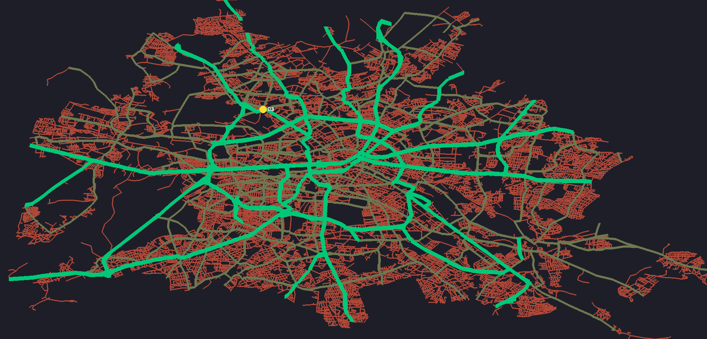
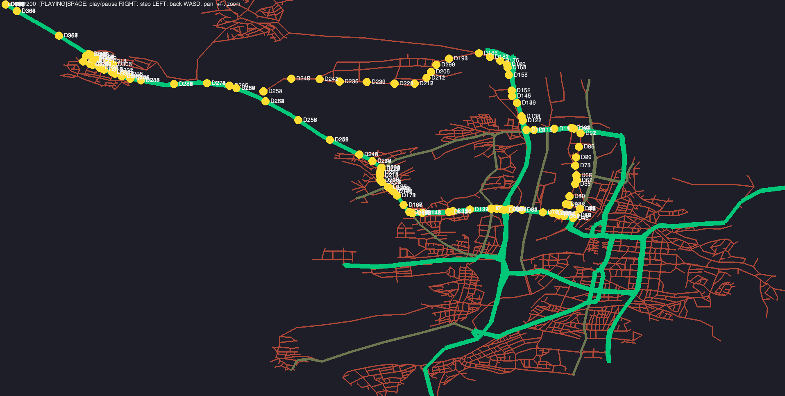
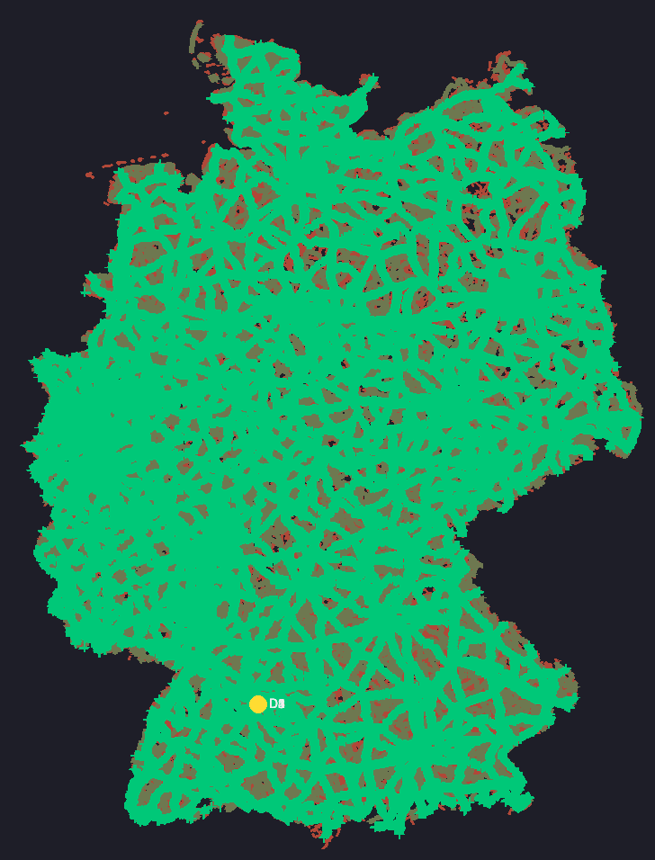

# FlyIn Map Generator

Generates drone-network configuration files usable in 42 FlyInfrom real-world street maps using OpenStreetMap data. Given a place name, it downloads the road network, assigns capacity tiers to roads, names every intersection hub, and outputs a ready-to-use `.txt` config.

## Requirements

```
osmnx
networkx
shapely
tqdm
```

Install with:
```bash
pip install osmnx networkx shapely tqdm
```

## Usage

```bash
python generator.py
```

You will be prompted for:

Region(s) | One or more place names, comma-separated (e.g. `Waiblingen, Germany`) Default: — 
Number of drones | Fleet size written into the config header Default: `5` 
Max hub spacing | Maximum distance (metres) between hubs on a single road segment  Default: `500` 

The output is saved as `<place_name>.txt` in the current directory.

## How It Works

1. **Downloads** the drivable road network for the given place from OSM and projects it to UTM (metres).
2. **Assigns road capacity** based on highway type — motorways/primary roads get capacity 10, secondary roads 5, and residential roads 2.
3. **Names hubs** from their adjacent street names, ensuring every hub has a unique, human-readable identifier. The first and last nodes are prefixed `start_` and `goal_`.
4. **Inserts via-hubs** along edges that exceed the max spacing, interpolating positions along the actual road geometry. Spacing scales with the road's speed limit so fast roads get more widely spaced hubs.
5. **Writes** `hub:`, `start_hub:`, `end_hub:`, and `connection:` lines into the output file.

## Config Options

At the top of `generator.py`:

```python
FLIP_X = False   # mirror the map left ↔ right
FLIP_Y = True    # mirror the map top ↔ bottom
```

`REFERENCE_SPEED_KMH` (default `50`) controls the baseline for speed-scaled hub spacing.

## Output Format

```
nb_drones: 5

# ── HUBS ──
start_hub: start_Bahnhofstrasse 4521 3847 [color=green max_drones=5]
hub: Hauptstrasse 4523 3850 [zone=normal color=blue max_drones=2]
end_hub: goal_Marktplatz 4530 3860 [color=yellow max_drones=10]

# ── VIA-HUBS (interpolated along long edges) ──
hub: Hauptstrasse_via_1 4525 3852 [zone=normal color=blue max_drones=2]

# ── CONNECTIONS ──
connection: start_Bahnhofstrasse-Hauptstrasse_via_1 [max_link_capacity=2]
...
```

## Examples 


Berlin


Heilbronn


Full road network of germany

download: https://drive.google.com/file/d/16rTD9AYOjF1LhhQdpgEEyGtVfNhHhhsN/view?usp=sharing
(warning: might break PC when loading into FlyIn)

